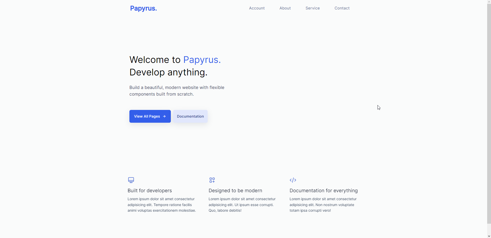

# Projeto Papyrus - Frontend



Bem-vindo ao repositório do **Projeto Papyrus**! Este é o coração do frontend da nossa plataforma de criação e colaboração de documentos baseada em React, TypeScript, HTML e CSS. Aqui, você encontrará tudo o que precisa saber sobre o frontend do Papyrus - desde uma visão geral do projeto até como contribuir e personalizar para suas próprias necessidades.

## Código Aberto

O Projeto Papyrus é um projeto de código aberto. Estamos entusiasmados em trabalhar com a comunidade de desenvolvedores para torná-lo ainda melhor. Sinta-se à vontade para explorar o código, abrir problemas (issues) para relatar bugs ou solicitar novos recursos, ou enviar solicitações de pull (pull requests) para contribuir diretamente com o desenvolvimento.

## Visão Geral

O Projeto Papyrus tem como objetivo revolucionar a maneira como as pessoas interagem e colaboram com documentos online, fornecendo uma experiência de edição e compartilhamento rica e intuitiva. Inspirado pelo Notion, nosso objetivo é criar um ambiente digital flexível onde você possa criar páginas de texto, documentos complexos e muito mais.

## Funcionalidades Principais

- **Edição de Texto Poderosa**: Crie documentos de texto com formatação rica, tabelas, listas e muito mais, tudo com uma interface intuitiva e responsiva.

- **Organização Intuitiva**: Estruture suas páginas de acordo com sua lógica com hierarquias personalizáveis e recursos de pesquisa avançada.

- **Colaboração Eficiente**: Trabalhe de forma eficiente com colegas de equipe em tempo real, seja para escrever, revisar ou apresentar informações.

- **Personalização Visual**: Adapte o ambiente às suas preferências com opções de estilo, como cores, fontes e temas.

## Configuração do Ambiente de Desenvolvimento

Para configurar seu ambiente de desenvolvimento e começar a trabalhar no frontend do Papyrus, siga estas etapas:

1. **Clone este Repositório**: Faça um clone deste repositório na sua máquina local.

2. **Instale as Dependências**: Certifique-se de ter o [Node.js](https://nodejs.org/) instalado. No diretório raiz do projeto, execute o seguinte comando para instalar as dependências:

   ```bash
   npm install


## Contribuindo
Nós adoramos receber contribuições para aprimorar o Papyrus! Você pode ajudar abrindo problemas (issues) para relatar bugs ou solicitar novos recursos, ou enviando solicitações de pull (pull requests) para contribuir diretamente com o código.

## Licença
O Projeto Papyrus é licenciado sob a Licença MIT. Isso significa que você é livre para usar, modificar e distribuir este projeto de acordo com os termos da licença.

